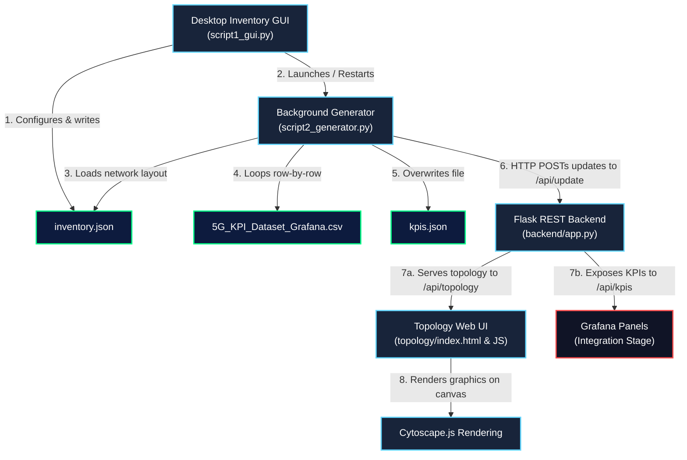

# 5G Service Multi-Domain Orchestrator (SMO) Dashboard & Simulator

This project is a functional, lightweight, local simulation environment for a **5G Service Multi-Domain Orchestrator (SMO)**. It simulates 5G network slicing, radio resource state management, and real-time topology visualization. It generates traffic and network performance telemetry based on standard 3GPP and SMO KPIs, and serves it through a REST API to support monitoring dashboard integrations (like Grafana) and interactive network graph representations.

---

## 📌 Project Overview & Purpose

The 5G SMO Dashboard project provides a testbed to model 5G topology nodes and monitor standard 3GPP and Radio Access Network (RAN) performance metrics. 
The system does the following:
1. **Configures the Network Topology**: Allows administrators to specify the size and density of the network (Cores, gNodeBs, and UEs).
2. **Simulates Real-time KPI Data**: Runs a background generator that reads a historical dataset of 5G KPIs, dynamically applies random node-level faults (active/inactive state transitions), and streams the metrics chronologically.
3. **Serves REST APIs**: Provides endpoints for fetching the network topology structure and current KPI metrics.
4. **Visualizes the Network Layout**: Displays a dynamic, web-based graph detailing nodes (Core, IMS, gNB, UE), connection edges, and real-time health indicators using Cytoscape.js.

---

## ⚙️ System Architecture

The project consists of three main components communicating via local networking and files:
1. **Desktop Inventory Configurator (GUI)**: Python/Tkinter GUI to scale the simulation.
2. **Background Data Generator**: Python simulator looping through the 5G KPI dataset and updating health status.
3. **Flask REST API Backend**: Python/Flask server storing states and exposing data endpoints.
4. **Topology Web Interface**: Cytoscape.js-based interactive layout rendering nodes, links, and real-time statuses.
5. **Grafana Dashboards** *(Integration Pending)*: Designed to fetch and chart live KPI parameters.



---

## 📈 5G KPIs & Functionality

The simulator exposes a comprehensive list of core 5G network performance indicators. These are sourced from the CSV dataset (`5G_KPI_Dataset_Grafana.csv`) and are updated every 5 seconds to represent changing network loads, resource constraints, and connection qualities.

| Metric | API Key | Type | Unit | Functionality & Explanation |
| :--- | :--- | :--- | :--- | :--- |
| **Active gNodeBs** | `active_gnbs` | Topology | Count | The number of gNB nodes currently operating in a "healthy" state. |
| **Total gNodeBs** | `total_gnbs` | Topology | Count | The total configured gNBs in the network simulation. |
| **Active Subscribers** | `active_subscribers` | Subscription | Count | Represents the number of distinct UEs (User Equipments) currently authenticated and attached to the core network. |
| **Active Sessions** | `active_sessions` | Core Control | Count | The number of active PDU (Protocol Data Unit) sessions currently established between the UEs and the User Plane Function (UPF). |
| **Downlink Bitrate** | `downlink_bitrate` | Data Plane | Mbps | Total data transmission rate from the network to the UEs. Critical for monitoring bandwidth and congestion. |
| **Uplink Bitrate** | `uplink_bitrate` | Data Plane | Mbps | Total data transmission rate from the UEs back to the network. |
| **Traffic Utilization** | `traffic_utilization` | Radio (PRB) | % | Physical Resource Block (PRB) utilization percentage. Indicates how much of the available wireless frequency spectrum is being consumed. |
| **RRC Success Rate** | `rrc_success_rate` | RAN Control | % | Radio Resource Control Connection Success Rate. The probability that a UE successfully establishes a control-plane link with a gNodeB. High rates indicate good coverage. |
| **Session Success Rate** | `session_success_rate` | Core Control | % | The success rate of creating PDU data sessions. Failures point to core network congestion or authentication issues. |
| **Handover Success Rate** | `handover_success_rate` | Mobility | % | The rate of successful user mobility transitions between neighboring gNBs. Dropped handovers result in disconnected calls/sessions. |
| **Latency** | `latency_ms` | Quality | ms | Round-trip time (RTT) delay for user packets. Low latency is crucial for URLLC (Ultra-Reliable Low-Latency Communications). |
| **Packet Loss** | `packet_loss_pct` | Quality | % | Percentage of packets sent that failed to reach their destination. High packet loss indicates interface interference or buffer overflows. |
| **Block Error Rate (BLER)** | `bler_pct` | Physical | % | Ratio of block errors to total transmitted blocks. Direct indicator of radio link quality and signal degradation. |
| **Core Resource Util.** | `core_resource_utilization_pct` | Infrastructure | % | CPU/memory/compute resource utilization in the 5G Core Virtual Network Functions (VNFs). |
| **UE Throughput** | `ue_throughput_mbps` | User Exp | Mbps | Individual user-level throughput. Shows the typical bandwidth experienced by a single active UE. |

---

## 🚦 How to Run the Project

To start the simulator, REST backend, and topology viewer, follow these steps in separate terminal shells:

### 1. Start the Flask Backend API
Launch the REST server that manages and serves the state of the network.
```powershell
cd d:\IITD\5G-SMO-Dashboard
python backend/app.py
```
*Port:* `5000` (Flask exposes endpoints at `http://localhost:5000/api/...`)

### 2. Start the Topology Web Server
Expose the Cytoscape.js frontend page locally.
```powershell
cd d:\IITD\5G-SMO-Dashboard\topology
python -m http.server 8000
```
*URL:* Open `http://localhost:8000` in your web browser.

### 3. Open the Desktop GUI & Start Simulation
Run the desktop window to configure topology nodes and spin up the background data generator.
```powershell
cd d:\IITD\5G-SMO-Dashboard
python script1_gui.py
```
* **Steps**:
  1. Input the desired number of **Core Nodes**, **gNBs**, and **UEs** in the GUI.
  2. Click **Generate & Start**.
  3. This action creates `backend/data/inventory.json` and spins up the background worker `script2_generator.py`, which constantly reads the KPI CSV and streams telemetry to the Flask API.
  4. Watch the `http://localhost:8000` web page dynamically rearrange and update node health states every 5 seconds.

---

## 📅 Roadmap: Done vs. Pending

### Done ✅
* [x] **Desktop Inventory Configurator GUI**: Tkinter GUI to easily modify the topology scale (`script1_gui.py`).
* [x] **Dynamic Graph Builder**: Logic in the generator to link Core -> IMS, Core -> gNB, and gNB -> UE (using round-robin allocation) and write layout structures.
* [x] **Simulation Data Engine**: Row-by-row playback of historical 5G metrics (`script2_generator.py`) to simulate live data streams.
* [x] **Stateful REST Backend**: Flask REST endpoints (`backend/app.py`) `/api/topology` and `/api/kpis` to cache and return the active simulation state.
* [x] **Interactive Topology Canvas**: cytoscape.js integration (`topology/index.html` & `topology.js`) displaying a dynamic network tree. Includes automatic node coordinate calculations based on viewport width.
* [x] **Real-time Node Outage Simulation**: Implemented 85/15 weight-based active/inactive state fluctuations for gNBs and IMS in the generator, which render dynamically in red/green on the Cytoscape canvas.

### Pending / Next Steps ⏳
* [ ] **Grafana Dashboard Configuration**: Create Grafana visualization dashboards using the JSON model to connect to the Flask `/api/kpis` endpoint.
* [ ] **Database Persistence**: Currently, backend values are stored in-memory (and falling back to `kpis.json` on disk). Integrating a timeseries database (like Prometheus, InfluxDB, or TimescaleDB) will allow historical KPI graphing in Grafana.
* [ ] **Historical API Queries**: Expose timeseries endpoints (e.g., `/api/kpis/history?minutes=30`) on Flask so Grafana can query trends instead of just the latest snapshot.
* [ ] **Dockerization**: Create a `Dockerfile` and a `docker-compose.yml` to launch the Flask Backend, Topology Web Server, and Grafana in a unified environment.
* [ ] **Production Server Setup**: Switch Flask from the development server to a production WSGI server (like Gunicorn or Waitress) for reliability.
* [ ] **Unit and Integration Tests**: Implement tests for backend route validation, topology positioning computations, and CSV file parser stability.
