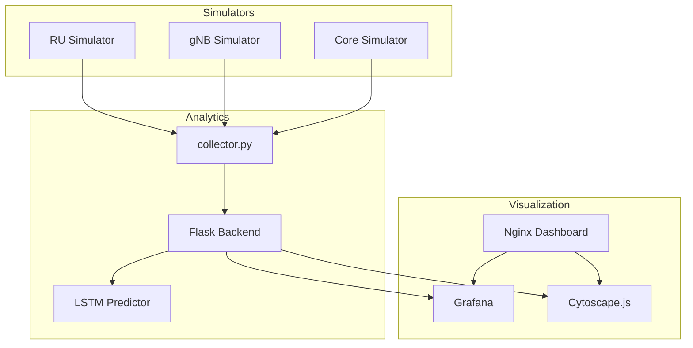

# 📡 5G Service Management & Orchestration (SMO) Dashboard


It is a **containerized 5G Service Management and Orchestration (SMO) Dashboard** that simulates a live telecom network, collects telemetry from multiple network elements, performs **real-time anomaly detection**, generates **AI-powered bitrate forecasts using LSTM**, and visualizes the complete network through **Grafana dashboards** and an interactive **Cytoscape.js topology**.

---

# ✨ Features

- 📊 Live 5G KPI monitoring
- 📡 Multi-node network simulation (RU, gNB, Core)
- 🔄 Automatic telemetry collection every 5 seconds
- 📈 Grafana dashboards with real-time visualization
- 🤖 LSTM-based bitrate prediction
- ⚠️ Statistical anomaly detection using EWMA + Z-Score
- 🌐 Interactive network topology using Cytoscape.js
- 🐳 Fully Dockerized deployment
- 🔌 REST APIs for telemetry, predictions, and topology

---

# 📸 Dashboard Preview

> Add screenshots here.

```
images/
├── dashboard.png
├── topology.png
└── anomaly.png
```

Example:

```markdown


```

---

# 🏗️ Architecture



---

# 🔄 Data Flow

1. **RU, gNB and Core simulators** generate live network telemetry.
2. **collector.py** polls each simulator every **5 seconds**.
3. The merged metrics are sent to the **Flask backend**.
4. The backend

   - stores historical data
   - performs anomaly detection
   - runs LSTM inference
   - exposes REST APIs

5. Grafana and Cytoscape consume these APIs for visualization.

---

# 🛠 Technology Stack

| Category | Technologies |
|-----------|--------------|
| Backend | Flask, Flask-CORS |
| AI | TensorFlow, Keras, Scikit-Learn |
| Visualization | Grafana, Cytoscape.js |
| Infrastructure | Docker, Docker Compose |
| Language | Python 3.11 |
| Web Server | Nginx |

---

# 📈 Analytics

## Statistical Anomaly Detection

Monitors **11 network KPIs** using:

- Exponentially Weighted Moving Average (EWMA)
- Rolling Standard Deviation
- Z-Score

An anomaly is triggered when

```
|Z-Score| > 2.5
```

---

## LSTM Forecasting

The predictive model performs **multivariate forecasting**.

### Input

- 20 historical timesteps
- (100 seconds)

### Output

- 5 future timesteps
- (25 seconds)

Predicted metrics

- Downlink Bitrate
- Uplink Bitrate

The backend caches inference results so multiple requests reuse the same prediction.

---

# 🚀 Getting Started

## Prerequisites

- Docker
- Docker Compose
- Python 3.11

---

## Clone Repository

```bash
git clone https://github.com/<username>/5G-SMO-Dashboard.git

cd 5G-SMO-Dashboard
```

---

## Install Dependencies

```bash
pip install "numpy<2"

pip install protobuf==3.20.3

pip install tensorflow

pip install scikit-learn

pip install pandas
```

---

## Train the LSTM Model

```bash
python backend/train_lstm.py
```

This generates

```
backend/model/

├── lstm_weights.h5

└── scaler.pkl
```

---

## Launch Services

```bash
docker compose up --build -d
```

---

# 🌐 Available Services

| Service | URL |
|----------|-----|
| Dashboard Portal | http://localhost:8080 |
| Grafana | http://localhost:3000 |
| Flask API | http://localhost:5000 |
| Topology | http://localhost:8000 |

Grafana Credentials

```
Username : admin

Password : admin123
```

---

# 📡 REST API

## Latest KPIs

```
GET /api/kpis
```

Returns the latest KPI snapshot.

---

## Historical Data

```
GET /api/history
```

Returns the last 100 telemetry records.

---

## Anomaly Detection

```
GET /api/predict/anomaly/table
```

Returns anomaly statistics for every monitored KPI.

---

## LSTM Prediction

```
GET /api/predict/lstm/downlink_bitrate

GET /api/predict/lstm/uplink_bitrate
```

Returns

- Future timestamps
- Predicted values

---

## Network Topology

```
GET /api/topology
```

Returns Cytoscape-compatible graph data.

---

# 📂 Project Structure

```text
5G-SMO-Dashboard/

├── backend/

│ ├── app.py

│ ├── collector.py

│ ├── train_lstm.py

│ └── model/

├── simulators/

│ ├── ru_sim.py

│ ├── gnb_sim.py

│ └── core_sim.py

├── grafana/

├── topology/

├── dashboard-shell/

├── docker-compose.yml

└── README.md
```

---

# ⚠️ Known Limitations

### Grafana JSON Datasource

The current version of

```
marcusolsson-json-datasource
```

contains a React Query Editor bug.

Instead of editing dashboards from the Grafana UI, update dashboards through Grafana's HTTP API.

---

### Future Predictions

Forecasts extend beyond the current time window.

To visualize them correctly in Grafana, extend the dashboard time range to

```
now-15m → now+5m
```

---

# 🔮 Future Enhancements

- Multi-cell network simulation
- AI root cause analysis
- Automatic fault recovery
- Prometheus integration
- Kubernetes deployment
- O-RAN Near-RT RIC integration
- Multi-tenant dashboard support

---

# 👨‍💻 Authors

Developed as part of the **5G Research Translation Project** focusing on **Service Management and Orchestration (SMO)** for next-generation telecom networks.

---

# 📄 License

This project is intended for educational and research purposes.
